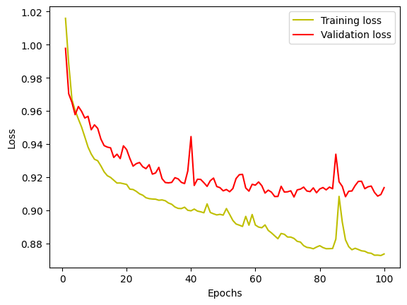
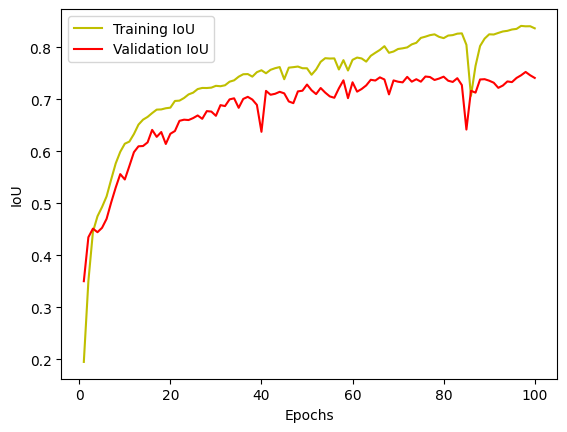
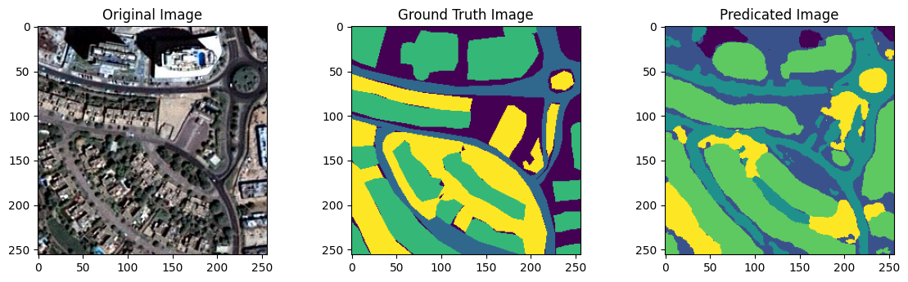

# Satellite Image Segmentation with Deep Learning

> **Project Goal**  
> To develop a deep learning model (specifically, a U-Net variant) that segments satellite images into distinct classes (e.g., buildings, water, vegetation, roads, land, and unlabeled areas).  

Welcome to this repository! Below, you will find an overview of how we prepared the data, built the model, trained it, and validated our results. We will also take a peek at interesting code snippets, along with short examples that (hopefully) keep you as amused as a caffeinated hamster.

---

## Table of Contents
1. [Overview of the Dataset](#overview-of-the-dataset)  
2. [Data Preprocessing](#data-preprocessing)  
3. [Model Architecture](#model-architecture)  
4. [Loss Function & Metrics](#loss-function--metrics)  
5. [Training & Validation](#training--validation)  
6. [Results & Visualization](#results--visualization)  
7. [Future Work](#future-work)  

---

## Overview of the Dataset
The dataset consists of satellite _tiles_, each containing corresponding **images** and **masks**:

- **Images** are `.jpg` files containing RGB channels.  
- **Masks** are `.png` files with assigned color codes for the different classes (building, land, road, vegetation, water, unlabeled).  

For sanity checks, we read the files and discovered the usual suspects:  
```bash
['image_part_001.png', 'image_part_002.png', 'image_part_003.png', ... ]
```
We also realized that each tile might have images of slightly different sizes. Since neural networks are picky about consistent input dimensions, we decided to patchify them into smaller squares, such as 256×256 or 512×512.  

> **Fun fact**: The reason we “patchify” large images is similar to how pizza is sliced. You don't want to feed the entire pizza into your mouth all at once. Also, slicing helps ensure each piece is uniformly sized—makes the ML pipeline quite digestible.

---

## Data Preprocessing
### 1. Image Patch Creation
We use [patchify](https://github.com/dovahcrow/patchify.py) to split each large tile into non-overlapping 256×256 patches. Then:

```python
image_patch_size = 256
patched_images = patchify(image, (image_patch_size, image_patch_size, 3), step=image_patch_size)
```

Because not all tiles' dimensions are multiples of 256, we further cropped the images so that the width and height align nicely with our chosen patch size.

### 2. Normalization & Transformations
- **MinMaxScaler**: We normalized image pixel intensities into a [0,1] range.  
- **One-Hot Encoding for Masks**:  
  - We mapped each RGB color in the mask to an integer (e.g., water → 0, land → 1, road → 2, etc.).  
  - We then expanded these labels into a categorical (one-hot) format with 6 classes.  

```python
labels_categorical_dataset = to_categorical(labels, num_classes=total_classes)
```

Thus, each label becomes a 6-dimensional vector.

> **Short Example**: If a pixel belongs to class **land**, its label might look like `[0, 1, 0, 0, 0, 0]`. If it’s **unlabeled**, the label might be `[0, 0, 0, 0, 0, 1]`.  

---

## Model Architecture
We adopt a **U-Net**-style architecture tailored for multi-class segmentation. Below is a quick summary:

1. **Downsampling/Encoder**: Convolution → ReLU → Dropout → MaxPooling.  
2. **Upsampling/Decoder**: Transposed Convolution → Concatenate with corresponding encoder layer → Convolution.  
3. **Final Output**: `Conv2D(n_classes, (1,1), activation="softmax")` for multi-class classification.  

```python
def multi_unet_model(n_classes=5, image_height=256, image_width=256, image_channels=1):
    # Encoding Path
    c1 = Conv2D(16, (3, 3), activation="relu", kernel_initializer="he_normal", padding="same")(inputs)
    c1 = Dropout(0.2)(c1)
    c1 = Conv2D(16, (3, 3), activation="relu", kernel_initializer="he_normal", padding="same")(c1)
    p1 = MaxPooling2D((2, 2))(c1)

    c2 = Conv2D(32, (3, 3), activation="relu", kernel_initializer="he_normal", padding="same")(p1)
    c2 = Dropout(0.2)(c2)
    c2 = Conv2D(32, (3, 3), activation="relu", kernel_initializer="he_normal", padding="same")(c2)
    p2 = MaxPooling2D((2, 2))(c2)

    c3 = Conv2D(64, (3, 3), activation="relu", kernel_initializer="he_normal", padding="same")(p2)
    c3 = Dropout(0.2)(c3)
    c3 = Conv2D(64, (3, 3), activation="relu", kernel_initializer="he_normal", padding="same")(c3)
    p3 = MaxPooling2D((2, 2))(c3)

    c4 = Conv2D(128, (3, 3), activation="relu", kernel_initializer="he_normal", padding="same")(p3)
    c4 = Dropout(0.2)(c4)
    c4 = Conv2D(128, (3, 3), activation="relu", kernel_initializer="he_normal", padding="same")(c4)
    p4 = MaxPooling2D((2, 2))(c4)

    # Bottleneck
    c5 = Conv2D(256, (3, 3), activation="relu", kernel_initializer="he_normal", padding="same")(p4)
    c5 = Dropout(0.2)(c5)
    c5 = Conv2D(256, (3, 3), activation="relu", kernel_initializer="he_normal", padding="same")(c5)

    # Decoding Path
    u6 = Conv2DTranspose(128, (2, 2), strides=(2, 2), padding="same")(c5)
    u6 = concatenate([u6, c4])
    c6 = Conv2D(128, (3, 3), activation="relu", kernel_initializer="he_normal", padding="same")(u6)
    c6 = Dropout(0.2)(c6)
    c6 = Conv2D(128, (3, 3), activation="relu", kernel_initializer="he_normal", padding="same")(c6)

    u7 = Conv2DTranspose(64, (2, 2), strides=(2, 2), padding="same")(c6)
    u7 = concatenate([u7, c3])
    c7 = Conv2D(64, (3, 3), activation="relu", kernel_initializer="he_normal", padding="same")(u7)
    c7 = Dropout(0.2)(c7)
    c7 = Conv2D(64, (3, 3), activation="relu", kernel_initializer="he_normal", padding="same")(c7)

    u8 = Conv2DTranspose(32, (2, 2), strides=(2, 2), padding="same")(c7)
    u8 = concatenate([u8, c2])
    c8 = Conv2D(32, (3, 3), activation="relu", kernel_initializer="he_normal", padding="same")(u8)
    c8 = Dropout(0.2)(c8)
    c8 = Conv2D(32, (3, 3), activation="relu", kernel_initializer="he_normal", padding="same")(c8)

    u9 = Conv2DTranspose(16, (2, 2), strides=(2, 2), padding="same")(c8)
    u9 = concatenate([u9, c1])
    c9 = Conv2D(16, (3, 3), activation="relu", kernel_initializer="he_normal", padding="same")(u9)
    c9 = Dropout(0.2)(c9)
    c9 = Conv2D(16, (3, 3), activation="relu", kernel_initializer="he_normal", padding="same")(c9)

    outputs = Conv2D(n_classes, (1, 1), activation="softmax")(c9)
    model = Model(inputs=[inputs], outputs=[outputs])

    return model
```

> **Fun aside**: Think of the U-Net architecture like a symmetrical hourglass. It pinches down the image data in the middle, then tries to reconstruct it back up. If it were a building, it’d be the wonkiest hourglass-shaped tower in the city—yet excellent at capturing context on the way down and reconstructing finer details on the way up.

---

## Loss Function & Metrics
### 1. **Dice Loss** 
Helps handle data imbalance. Intuitively measures how well the predicted segmentation overlaps with the true mask.

### 2. **Categorical Focal Loss** 
Helps focus the model on classes that are harder to predict.

### 3. **Total Loss** 
I sum **Dice Loss** and **Focal Loss** (weighted 1:1) to get our final objective.  

### 4. **Jaccard Coefficient (IoU)** 
Used as an additional metric to evaluate overlap between our predictions and ground truth masks.

> **Quick Example**: If your predicted building region has 80% overlap with the real building region, your IoU for that class is 0.8.  

---

## Training & Validation
I split the data into **85% training** and **15% validation**. The training happens for 100 epochs on mini-batches of 16 images at a time:

```python
model.compile(optimizer="adam", 
              loss=total_loss, 
              metrics=["accuracy", jaccard_coeff])

history_a = model.fit(X_train, y_train,
                      batch_size=16,
                      epochs=100,
                      validation_data=(X_test, y_test),
                      shuffle=False)
```
Each epoch logs:
- **Training Loss, Accuracy, IoU**  
- **Validation Loss, Accuracy, IoU**  

### Training Curves
After training, I plot the **loss** and **IoU** curves:

```python
plt.plot(epochs, loss, 'y', label='Training loss')
plt.plot(epochs, val_loss, 'r', label='Validation loss')
plt.legend(); plt.show()
```
 

A typical learning curve shows that both training and validation losses decrease over time (with some fluctuations, of course).

---

## Results & Visualization
I generate segmentation predictions on `X_test`. Then, I compare them to the ground truth:

```python
y_pred = model.predict(X_test)
y_pred_argmax = np.argmax(y_pred, axis=3)
y_test_argmax = np.argmax(y_test, axis=3)
```

Random example visualization:

```python
test_image = X_test[some_random_number]
prediction = model.predict(np.expand_dims(test_image, 0))
predicted_image = np.argmax(prediction, axis=3)[0, :, :]
```

**Below** is a conceptual side-by-side:
```
+------------------------+----------------------+----------------------+
|      Original Image    |   Ground Truth Mask |   Predicted Mask    |
+------------------------+----------------------+----------------------+
| (a pretty satellite    |  (RGB-coded classes)|  (integer-labeled   |
|   tile from above)     |                     |    mask, or a color |
|                        |                     |    map if preferred)|
+------------------------+----------------------+----------------------+
```
Often, the predicted mask looks quite similar to the ground truth. Small discrepancies might remain around boundary regions or less frequent classes.


---

## Future Work
1. **Data Augmentation**: Adding random flips, rotations, or color jitters could yield more robust models.  
2. **Larger Patch Size**: Sometimes 512×512 patches allow the network to capture more context. (Though it may require more GPU memory.)  
3. **Advanced Architectures**: Experiment with Transformers or state-of-the-art architectures such as SegFormer or DeepLabv3.  

> **Potential Funny Side Quest**: Provide a short “Where’s Waldo?” twist—where the “Waldo” class is set to a unique color, and I see if the network can find him from a tiny satellite vantage point.

---

## Model Saving
Finally, I save our trained U-Net model as an `.h5` file (with a friendly note that the HDF5 format is somewhat “legacy” in modern Keras land):

```python
model.save("satellite_segmentation_full.h5")
```

---

## Contact
Please feel free to open an Issue or Pull Request if you have any suggestions or discover potential improvements.
